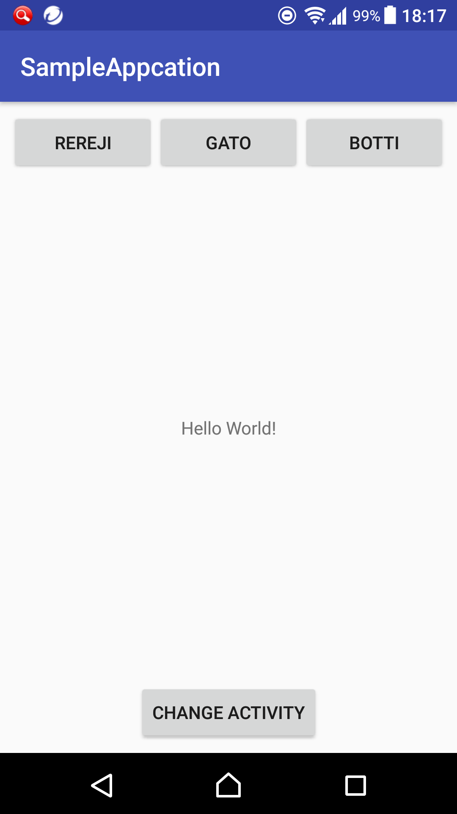
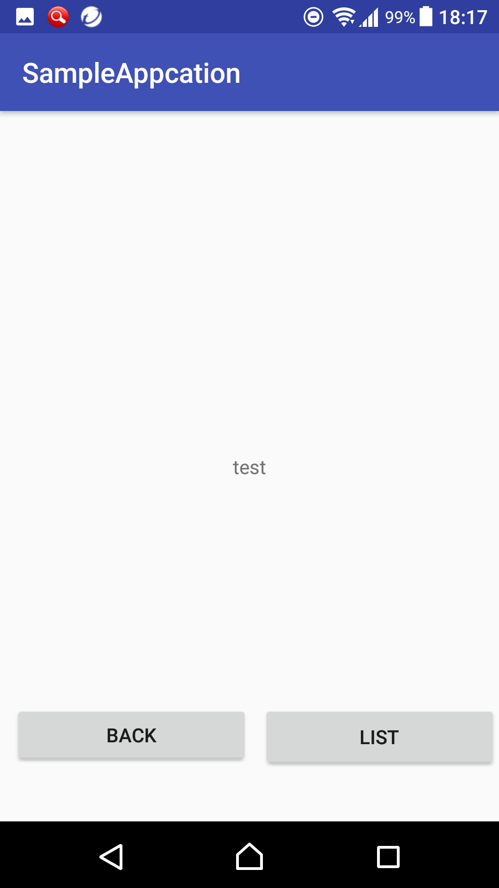

 
# TestAndroidApp
大学の講義でAndroidアプリを作成するので使いそうな機能とか使ってみてます。

## 開発環境
以下はAndroid StudioのFile>Project Structure等で確認できます
| Sdkとか |   |
|:------|:-----------:|
| OS | Windows10 |
| IDE | Android Studio |
| Cradle Version | 4.1 |
| Android Plugin Version | 3.0.0 |
| Complie Sdk Version | API26 |
| Min Sdk Version | API19 |
| Target Sdk Version | API26 |

|リンゴ|ブドウ|
|---|---|
|10|20|

## 実装済み（確認済み）
* Activityのライフサイクル
* Activity間のデータの受け渡し
* Activity切り替え
* ボタンの操作
* ArrayListからのリストの表示
* リストの要素の加工
* クラス+ArrayListによる複数データの管理
* すべてのクラスからの複数データへのアクセス(ローカルDB)
* リスト選択
* タブ切り替え
* GPS

## 実装予定（確認予定）
* カメラ
* WebAPIの利用
* サーバのデータベースへのアクセス
* Bluetooth

## 実行
一番上の階層にあるapkファイルをAndroid端末にインストールして実行すれば
作成中のアプリが実行できます。
もしかしたら発行元不明のアプリを許可みたいなのを設定でしないといけないかもしれません

たぶん大丈夫だと思いますが、アプリによってスマホに異常をきたす可能性があるので
実行するときは自己責任でお願いします。

## 実装画面

